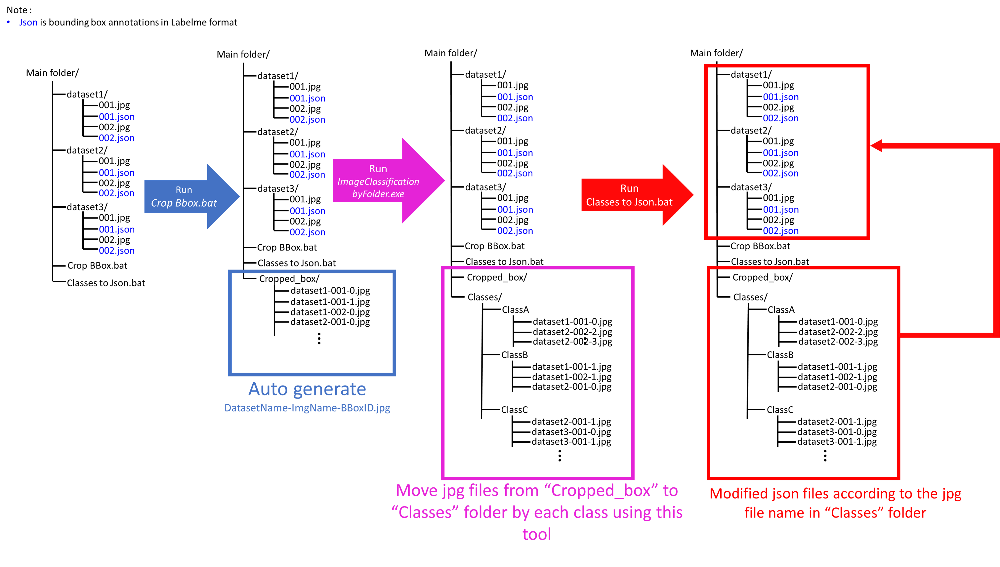

# **Introduction**
A labeling tool for quick image classification
***

## **Something you need to now**
The exe file can be downloaded from [here](https://github.com/ChiHangChen/ImageClassificationbyFolder/releases).

1. Press `Save` button and save classified images into **Classes** folder.

2. The originial image annotaions must saved as the same as **[labelme](https://github.com/wkentaro/labelme)** json format.

3. `Crop BBox.bat` must put in the main folder to crop the bounding box.

4. `Classes to Json.bat` must put in main dataset folder to merge the final classified bbox into original json annotations.

5. This tool is developed in windows10 64 bit.

  

