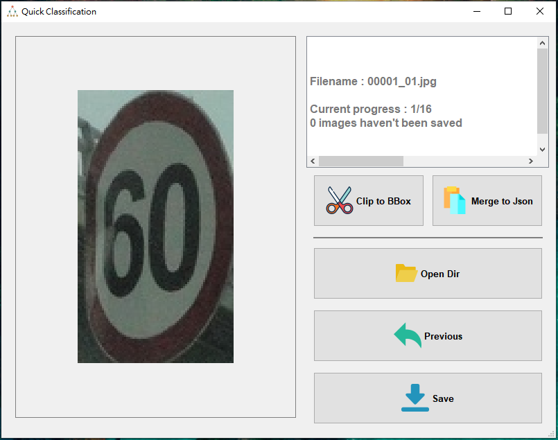

# **Introduction**

A labeling tool for quick image classification.

This tool can classify each image to its classes folder by simply press the keyboard.

***

  

## **Something you need to now**
The exe file can be downloaded from [here](https://github.com/ChiHangChen/ImageClassificationbyFolder/releases).

1. Press `Save` button and save classified images into **Classes** folder.

2. The originial image annotaions must saved as the same as **[labelme](https://github.com/wkentaro/labelme)** json format.

